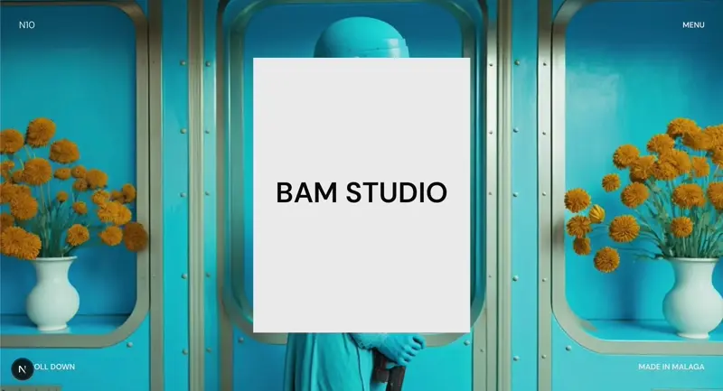
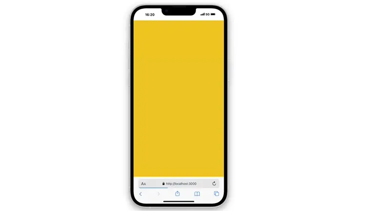

# GSAP + React Intro/Outro Animation 🚀

_(Recomiendo agregar un GIF/video demo aquí)_

Una animación fluida de entrada y salida (intro/outro) creada con **GSAP** y **React**, perfecta para páginas de inicio, portfolios, transiciones entre rutas o pagina de loading mientras carga la página.

## ✨ Características

- **Animación en 3 etapas**:
  1. Pantalla inicial de carga con logo
  2. Transición con efecto "reveal"
  3. Contenido principal con animación escalonada
- **Uso avanzado de GSAP**:
  - Timelines para secuencias complejas
  - Easing personalizado (`expo.inOut`)
  - Stagger effects para elementos listados
- **Responsive**: Diseño que se adapta a diferentes tamaños de pantalla
- **Fácil integración**: Componente React listo para implementar

## 🔧 Personalización

Ajusta en `IntroAnimation.js`:

- **Duración**: Modifica los valores en los métodos `tl.to()` y `tl.fromTo()`
- **Efectos**:
  - Cambia los tweens de GSAP (`y`, `opacity`, `scale`, etc.)
- **Timing**: Controla los delays entre animaciones con `stagger` y posiciones absolutas en la timeline

## 🧠 Tecnologías

- [GSAP](https://greensock.com/gsap/) - Motor profesional de animaciones
- [React](https://reactjs.org/) - Biblioteca frontend
- [Next.js](https://nextjs.org/) - Framework de React para produccióncomplementarias
